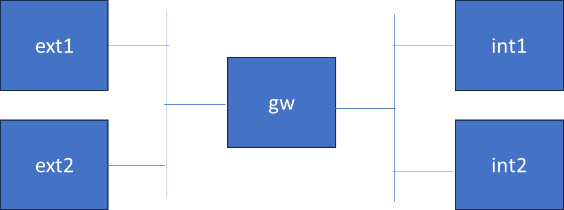

# Introduction

This is the common setup for the practice exercises in this module.  Since the module is about things you'd do at a network gateway, we'll create a Topology with 2 nodes that we'll mark as external, 2 nodes that we'll mark as internal, and a gatwate in between.  The topology is shown below.




## Instructions

We'll use [containerlab](https://containerlab.dev/) to create this topology. The topology is described in 2ext2int-mod3.clab.yml. The toplogy is named mod3-2ext2int, so the name of containers will be, e.g., clab-mod3-2ext2int-ext1 (where ext1 is the node name).

For this topology, we're going to use two bridges (br-int and br-ext).  These will represent an Internal network and an External network, respectively. In the picture, the bridge br-ext is the vertical line which ext1, ext2, and the left side of gw connects to.  The bridge br-int is the vertical line which int1, int2, and the right side of gw connects to.

To realize this in containerlab, we'll create two nodes, both of kind bridge.

```
    br-int:
      kind: bridge
    br-ext:
      kind: bridge
```


In containerlab, kind bridge means that it expects a Linux bridge of that name to exist.

So, first thing to do is run `./make_bridges.sh`.  We learned how to do this in Module 1, so if you want to try to do it without looking at the script, that'd be good practice.

Once those are created, you can now deploy the containerlab setup.

```
sudo containerlab deploy
```

As we have done in the other modules, we'll use aliases for the docker exect command. 

```
source make_aliases.sh
```


